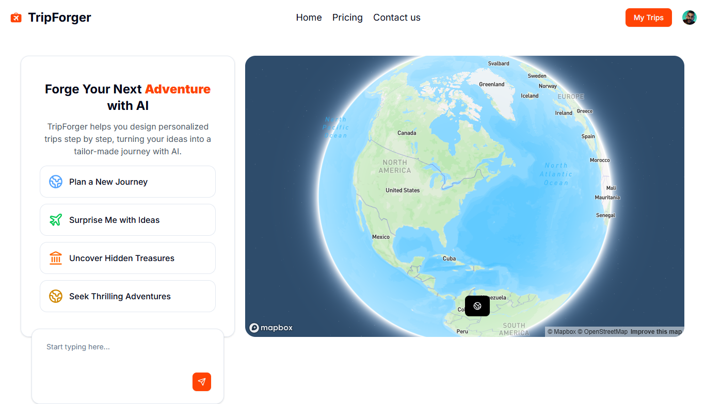

````markdown
# 🌍 TripForger  

AI-powered Full Stack Trip Planner built with **Next.js, React, TypeScript, Arcjet, Convex, Clerk, Mapbox, and Google Places API** ✈️  



---

## 🚀 Project Overview  

TripForger is an AI-driven web application that helps users **plan personalized trips** effortlessly.  
It integrates AI for trip suggestions, interactive maps with **Mapbox**, real-time location data via **Google Places API**, and secure authentication through **Clerk**.  

✨ Features:  
- 🤖 **AI Trip Planner** – Generate custom trip itineraries instantly.  
- 🗺️ **Interactive Maps** – Explore routes and locations via Mapbox.  
- 🔒 **User Authentication** – Managed with Clerk.  
- 📍 **Location Search** – Powered by Google Places API.  
- ⚡ **Rate Limiting & Security** – Using Arcjet.  
- 💾 **Serverless Backend** – Convex for queries and mutations.  
- 📧 **Email Integration** – Resend for notifications.  
- 🎨 **UI/UX** – Built with TailwindCSS, Radix UI, Lucide & Tabler icons.  

💡 **Note:** Free users are limited to **two trip builds every 24 hours**.  

---

## 🛠️ Tech Stack  

- **Frontend**: Next.js 15, React 19, TypeScript, TailwindCSS, Radix UI  
- **Backend**: Convex (serverless functions)  
- **Authentication**: Clerk  
- **APIs**: OpenAI, Google Places API, Mapbox  
- **Security & Rate Limiting**: Arcjet  
- **Email**: Resend  
- **Other**: Axios, UUID, Motion animations  

---

## ⚙️ Installation  

Clone the repository:  

```bash
git clone https://github.com/DANKAMN/tripforger.git
cd tripforger
````

Install dependencies:

```bash
npm install
```

Set up environment variables:

Create a `.env.local` file in the root directory and configure the following keys:

```bash
# Next.js
NEXT_PUBLIC_SITE_URL=http://localhost:3000

# Clerk
NEXT_PUBLIC_CLERK_PUBLISHABLE_KEY=your_publishable_key
CLERK_SECRET_KEY=your_secret_key
NEXT_PUBLIC_CLERK_SIGN_IN_URL=/sign-in
NEXT_PUBLIC_CLERK_SIGN_UP_URL=/sign-up

# Arcjet
ARCJET_KEY=your_arcjet_key

# Convex
NEXT_PUBLIC_CONVEX_URL=your_convex_url

# APIs
NEXT_PUBLIC_MAPBOX_TOKEN=your_mapbox_token
NEXT_PUBLIC_GOOGLE_PLACES_API_KEY=your_google_places_api_key
OPENAI_API_KEY=your_openai_api_key

# Resend
RESEND_API_KEY=your_resend_api_key
```

---

## 🏃 Running the App

### Development

```bash
npm run dev
```

### Production Build

```bash
npm run build
npm run start
```

The app will be available at [http://localhost:3000](http://localhost:3000).

---

## 📦 Scripts

* `npm run dev` → Start development server
* `npm run build` → Build the project for production
* `npm run start` → Start the production server

---

## 📌 Deployment

The project is optimized for deployment on **Vercel**.
Make sure your environment variables are set in the Vercel dashboard before deploying.

---

## 🤝 Contributing

Contributions are welcome!

1. Fork the repo
2. Create a new branch (`feature/new-feature`)
3. Commit changes
4. Open a Pull Request

---

## 📜 License

This project is licensed under the **MIT License**.